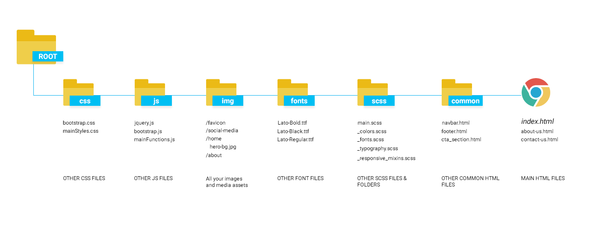

## 📂 Estructura de carpetas en desarrollo web
---
---
<br>

Dentro del conjunto de **buenas prácticas** que debemos ir adoptando como desarrollador@s, se encuentra la tarea de mantener en orden todos los ficheros de nuestro proyecto.  

No existe un estándar rígido sobre cómo organizar los elementos de un proyecto web, pero sí es importante tener en mente que el orden nos facilitará poder trabajar en armonía con los integrantes del resto del equipo e incluso con nosotros mismos cuando trabajamos de manera individual, encontrar fácilmente lo que necesitamos y, en consecuencia, trabajar más rápido, de manera más cómoda y de forma más eficiente. 

En un proyecto de tamaño _medio a grande,_ este podría ser un ejemplo de estructura de carpetas efectivo:


> [Fuente: medium.com](https://medium.com/@nmayurashok/file-and-folder-structure-for-web-development-8c5c83810a5)

<br>

Otro modelo de estructura de carpetas más sencillo podría ser el siguiente:

``` 
📂 nombre-de-proyecto
 |__📂 assets
 |   |__📂 images
 |      |   🖼️ image-file.jpg
 |      |   🖼️ logo.png
 |      |__ 📂 biography
 |      |       🖼️ image-file.jpg
 |      |       🖼️ image-file.jpg
 |      |__ 📂 portfolio
 |              🖼️ image-file.jpg
 |              🖼️ image-file.jpg
 |              🖼️ image-file.jpg
 |
 |__📂 styles
 |      📄 style.css
 |__📂 scripts
 |      📄 script.js
 |__📂 pages
 |      📄 biography.html
 |      📄 contact.html
 |      📄 portfolio.html
 |__📄 index.html

```   
<br>


### 🔙 [ÍNDICE](../../readme.md)